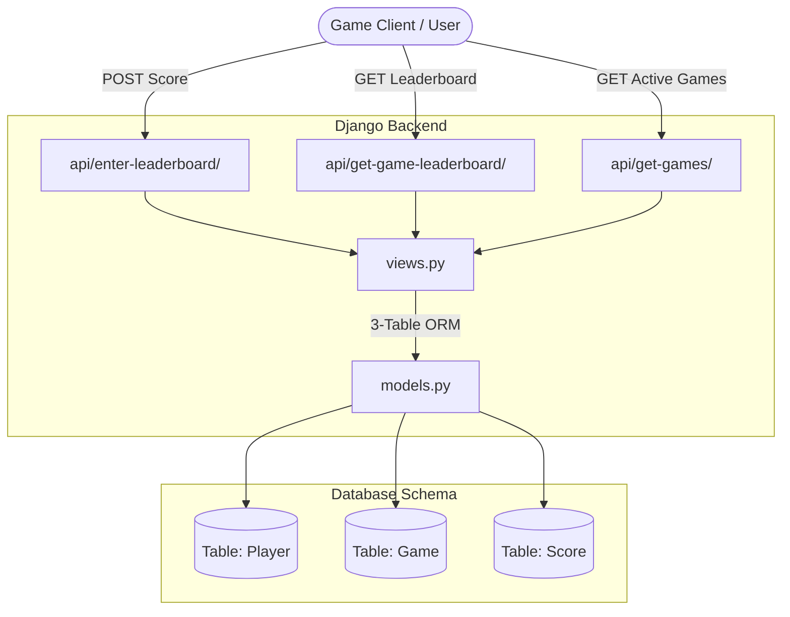

# Centarius Leaderboard Hub 🏆

Welcome to the **Centarius Leaderboard Hub**, a high-performance, aesthetically stunning gaming leaderboard system. This project is built using a modern Django backend combined with a gorgeous, responsive vanilla glassmorphic frontend interface designed to track, rank, and showcase players' top achievements.

---

## 🌟 Key Features

- **Normalized 3-Table Schema**: Robust database architecture featuring strict indexing and conditional database constraints.
- **Conditional Upsert API**: Saves and processes new scores dynamically, ensuring each player holds exactly one (their highest) score record per tournament/game.
- **Dynamic Leaderboard Dashboard**: Real-time frontend updating with beautiful slide notifications (toasts) and smooth visual indicators.
- **Premium Glassmorphic Design**: Curated color tokens (neon cyan & purple gradients),Outfit Google Font typography, glowing custom hover animations, and special gold/silver/bronze rank badge layouts.
- **Active Tournament Polling**: Keeps data synchronized live by querying endpoints every 10 seconds under the hood.
- **Custom Data Seeding**: Ready-to-go management tools to seed the database with legendary games and highly competitive scores.

---

## 📐 Project Architecture



### 1. The 3-Table Database Schema (`leaderboard/models.py`)

To ensure database normalization and data integrity, the system is designed with a strict **3-table architecture**:
- **`Player`**: Unique `player_id` (used as the primary search lookup key) and a dynamic `display_name` that updates centrally if a player submits a score with a new moniker.
- **`Game`**: Unique `game_id` (e.g., `space-invaders`) and a formatted `title` (e.g., `Space Invaders`).
- **`Score`**: Junction table mapping `Player` and `Game` with an `IntegerField` for the score and a timestamp of when it was saved. An enforced `unique_together = ('player', 'game')` constraint guarantees that each player has at most one high-score entry per game.

---

## 🚀 Quickstart Guide

Getting up and running is incredibly simple. Follow these steps in your command prompt or terminal:

### 1. Activate the Virtual Environment
Activate the pre-configured Python virtual environment:
```powershell
# Windows PowerShell
.\venv\Scripts\Activate.ps1

# Windows CMD
.\venv\Scripts\activate.bat

# macOS/Linux
source venv/bin/activate
```

### 2. Verify Database Migrations
Make sure the SQLite database tables are fully migrated:
```bash
python manage.py migrate
```

### 3. Seed Mock Tournament Data
Populate the database with iconic retro games and fully populated competitive leaderboard rankings:
```bash
python manage.py seed_leaderboard
```
*This command resets any existing data and populates games like Centarius Run, Space Invaders, Pac-Man, Asteroids, and Cyber Knight with realistic competitive high scores.*

### 4. Run the Development Server
Start the local development server:
```bash
python manage.py runserver
```
Once started, open your web browser and navigate to **[http://127.0.0.1:8000/](http://127.0.0.1:8000/)** to interact with the dashboard.

---

## 🧪 Running Automated Tests

The project comes with a comprehensive suite of unit tests verifying all model constraints, conditional score updates, API responses, ordering/sorting, and query limit limits:
```bash
python manage.py test
```

---

## 🔌 API Reference

### 1. Submit Score (Conditional Upsert)
Creates or updates a score for a player and game. **Will only overwrite if the new score is strictly greater than the player's existing high score.**

- **Endpoint**: `POST /api/enter-leaderboard/`
- **Content-Type**: `application/json`
- **Request Body**:
  ```json
  {
    "game_id": "cyber-knight",
    "player_id": "cyber_knight",
    "display_name": "CyberKnight",
    "score": 98500
  }
  ```
- **Response Format (Success - Higher Score)**:
  ```json
  {
    "status": "success",
    "message": "Score processed successfully.",
    "data": {
      "game_id": "cyber-knight",
      "player_id": "cyber_knight",
      "display_name": "CyberKnight",
      "highest_score": 98500,
      "updated": true
    }
  }
  ```
- **Response Format (Success - Attempt was Lower than High Score)**:
  ```json
  {
    "status": "success",
    "message": "Score processed successfully.",
    "data": {
      "game_id": "cyber-knight",
      "player_id": "cyber_knight",
      "display_name": "CyberKnight",
      "highest_score": 150000,
      "updated": false
    }
  }
  ```

---

### 2. Fetch Leaderboard Rankings
Returns sorted top scores for a specific game, including dynamic rankings.

- **Endpoint**: `GET /api/get-game-leaderboard/`
- **Query Parameters**:
  - `game_id` (string, required): The ID of the game (e.g. `centarius-run`).
  - `limit` (integer, optional): Maximum scores to return. Defaults to `10`.
- **Response Format**:
  ```json
  [
    {
      "rank": 1,
      "player_id": "cyber_knight",
      "display_name": "CyberKnight",
      "score": 985000,
      "date_saved": "2026-05-25T09:55:12.123456Z"
    },
    {
      "rank": 2,
      "player_id": "arcade_ace",
      "display_name": "ArcadeAce",
      "score": 875200,
      "date_saved": "2026-05-25T09:55:12.543210Z"
    }
  ]
  ```

---

### 3. List Registered Games
Returns a list of all active games currently registered in the system.

- **Endpoint**: `GET /api/get-games/`
- **Response Format**:
  ```json
  [
    {"game_id": "asteroids", "title": "Asteroids"},
    {"game_id": "centarius-run", "title": "Centarius Run"},
    {"game_id": "cyber-knight", "title": "Cyber Knight"},
    {"game_id": "pac-man", "title": "Pac-Man"},
    {"game_id": "space-invaders", "title": "Space Invaders"}
  ]
  ```
